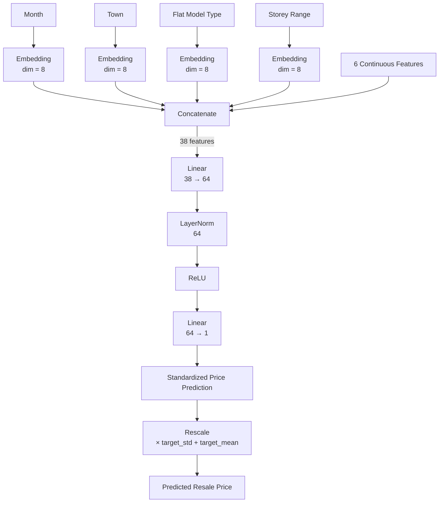

# neural-networks-assignment
## A1
### Baseline Model Architecture

```mermaid
flowchart TD
    A[Month] --> E1[Embedding<br/>dim = 8]
    B[Town] --> E2[Embedding<br/>dim = 8]
    C[Flat Model Type] --> E3[Embedding<br/>dim = 8]
    D[Storey Range] --> E4[Embedding<br/>dim = 8]

    E1 --> CAT[Concatenate]
    E2 --> CAT
    E3 --> CAT
    E4 --> CAT

    CONT[6 Continuous Features] --> CAT

    CAT -->|38 features| L1[Linear<br/>38 → 64]
    L1 --> LN[LayerNorm<br/>64]
    LN --> R[ReLU]
    R --> L2[Linear<br/>64 → 1]
    L2 --> S[Standardized Price Prediction]
    S --> DS[Rescale<br/>× target_std + target_mean]
    DS --> OUT[Predicted Resale Price]
```